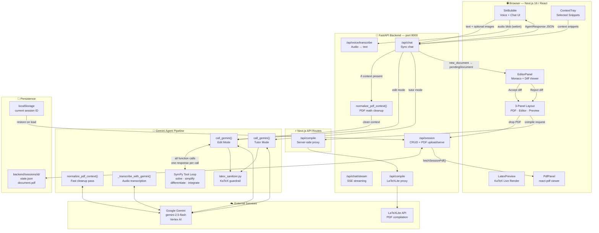
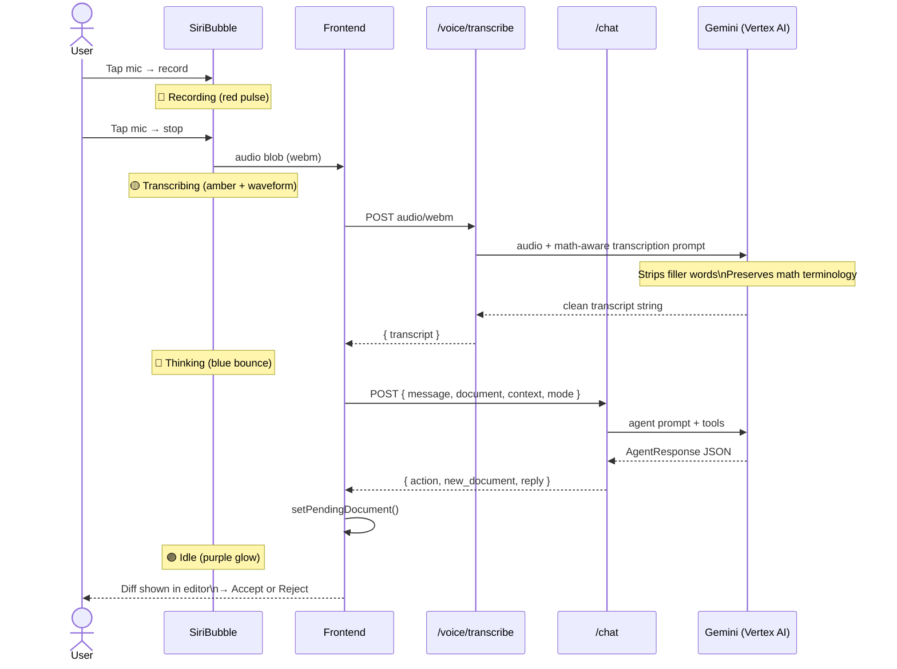
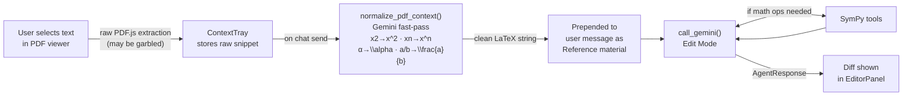
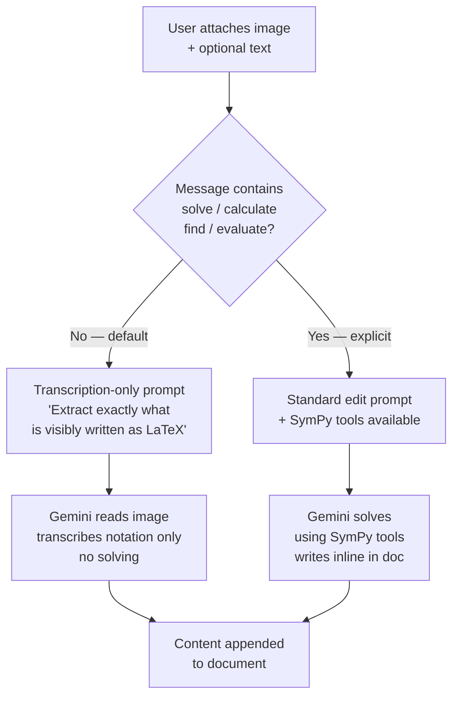
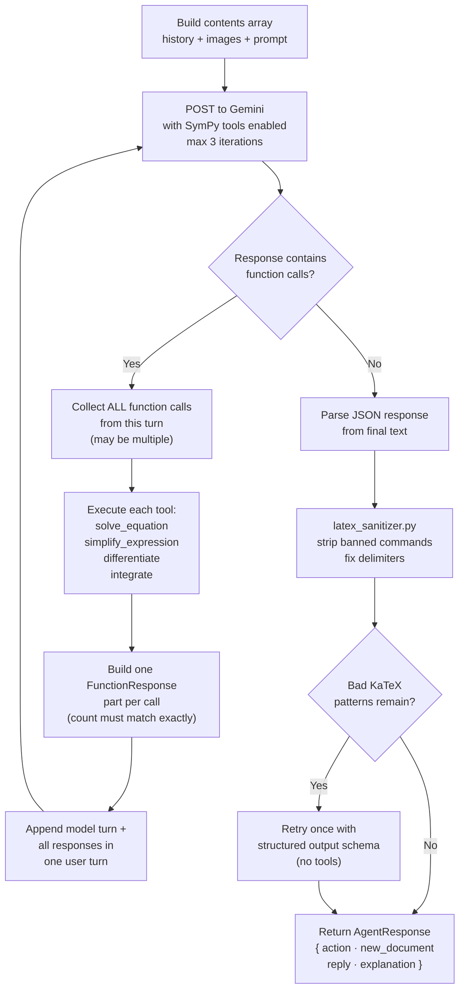
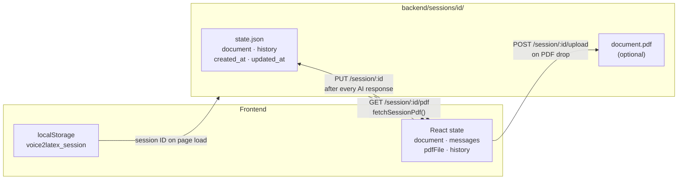

# StemFlow — Agentic Architecture

This document describes the full system architecture of StemFlow: the AI agent pipeline, data flows, tool integrations, and agentic capabilities powered by Google Gemini and SymPy.

---

## System Overview

---

## Voice → Document Flow

---

## PDF Context Pipeline

---

## Image Transcription Flow

---

## Gemini Tool Calling Loop

---

## Session Persistence

---

## Agentic Capabilities Summary

| Capability | Mode | Implementation |
|---|---|---|
| Symbolic equation solving | Edit | `solve_equation` via SymPy tool call |
| Expression simplification | Edit | `simplify_expression` via SymPy tool call |
| Symbolic differentiation | Edit | `differentiate` via SymPy tool call |
| Symbolic integration | Edit | `integrate` via SymPy tool call |
| Math-aware voice transcription | Both | Gemini multimodal audio, filler-word removal |
| Image → LaTeX transcription | Edit | Gemini vision, transcription-only by default |
| PDF math reconstruction | Edit | `normalize_pdf_context()` pre-pass before main call |
| Socratic tutoring | Tutor | Separate system instruction, no document mutation |
| LaTeX self-correction | Both | `latex_sanitizer.py` + structured-output retry |
| Agentic diff review | Edit | `pendingDocument` state → Monaco DiffEditor → Accept/Reject |
| PDF compilation | Both | LaTeXLite API via server-side proxy |
| Session persistence | Both | JSON + PDF stored per session on disk |
